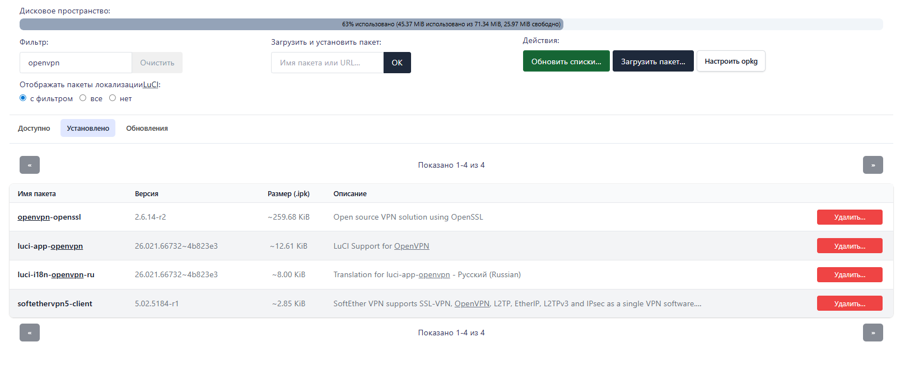

# Инструкция по настройке OpenVPN клиента для AntiZapret на Routerich

> Инструкция по настройке подключения к AntiZapret VPN через OpenVPN на роутерах с прошивкой **OpenWRT 24+** (Routerich и аналоги).

---

## 📋 Требования

- Роутер с прошивкой **OpenWRT 24+** (или совместимой, например Routerich)
- Скачанный конфигурационный файл `antizapret-tcp.ovpn`
- Доступ к веб-интерфейсу LuCI и/или SSH

---

## 🔹 Шаг 0: Отключение дополнительных пакетов производителя (Только Routerich)

> ⚠️ **Важно:** Не должно быть установлено **Podkop** / **Zeroblock** — они перестанут работать!

1. Перейдите: **Система** → **Автозапуск**
2. Нажмите **СТОП** и переключите: ❌ `включено` → ✅ `выключено` (интернет может пропасть!)
3. Отключите следующие сервисы:
   - `stubby`
   - `doh-proxy`
   - `dns-failsafe-proxy`
   - `stubby-intercept`
   - `youtubeUnblock`
4. Нажмите **Сохранить**

---

## 🔹 Шаг 1: Отключение DNS Rebinding

1. Откройте веб-интерфейс роутера (LuCI)
2. Перейдите: **Сеть** → **DHCP и DNS** → **Фильтр**
3. ❌ **DNS Rebinding** — снимите галочку
4. ✅ **Фильтровать IPv6-записи типа AAAA** — поставьте галочку
5. Перейдите во вкладку **«Перенаправление»** и удалите всё в разделе «Перенаправление запросов DNS»
6. Перейдите во вкладку **«Файлы resolv & hosts»**:
   - ✅ **Использовать /etc/ethers** — поставьте галочку
   - ❌ **Игнорировать файл resolv** — снимите галочку
7. Нажмите **Сохранить и применить**

---

## 🔹 Шаг 2: Установка пакетов OpenVPN

> Если прошивка от производителя, пакеты обычно уже установлены. Проверьте в любом случае.

1. Откройте **Система** → **Пакеты**
2. Переключитесь на вкладку **«Установлено»** и введите в поиск `openvpn`
3. Убедитесь, что установлены следующие пакеты:
   - `openvpn-openssl`
   - `luci-app-openvpn`
   - `luci-i18n-openvpn-ru` (или `luci-i18n-openvpn-en`)

   

4. Если пакеты не установлены — обновите список и установите их:
   ```sh
   opkg update
   opkg install openvpn-openssl luci-app-openvpn luci-i18n-openvpn-ru
   ```
5. После установки в верхнем меню появится раздел **VPN**

---

## 🔹 Шаг 3: Настройка DNS на WAN

1. Перейдите: **Сеть** → **Интерфейсы** → **WAN** → **Изменить**
2. Откройте вкладку **Расширенные настройки**
3. ❌ **Использовать объявляемые узлом DNS-серверы** — снимите галочку
4. В поле **Использовать собственные DNS-серверы** пропишите публичные DNS, например:
   - `1.1.1.1`
   - `9.9.9.9`
5. Нажмите **Сохранить и применить**

> ⚠️ Запомните эти DNS! Они понадобятся при редактировании конфигурации OpenVPN.

---

## 🔹 Шаг 4: Загрузка и редактирование конфигурационного файла

1. Скачайте файл `antizapret.ovpn` (udp или tcp)
2. Перейдите: **VPN** → **OpenVPN** → **Загрузка конфигурационного файла OVPN**
3. В поле **«Имя файла»** напишите любое удобное имя на латинице, например `OVPN`
4. Выберите скачанный файл и нажмите **Загрузить**
5. Файл появится в списке конфигураций
6. Сразу нажмите **Изменить** и в самое начало файла **построчно** добавьте:
   ```text
   pull-filter ignore block-outside-dns
   route 1.1.1.1
   route 9.9.9.9
   ```
   > Смысл: мы перехватываем DNS-запросы и направляем их через VPN-туннель.
7. Нажмите **Сохранить**

---

## 🔹 Шаг 5: Создание сетевого интерфейса OpenVPN

1. Перейдите: **Сеть** → **Интерфейсы** → **Добавить новый интерфейс…**
2. Заполните параметры:
   - **Имя**: `OVPN` (или любое латиницей)
   - **Протокол**: `Неуправляемый`
   - **Устройство**: `tun0` - самый низ "пользовательский" ввести вручную, т.к. интерфейса еще нету(мы опенВПН еще не запустили)
3. Нажмите **Создать интерфейс**
4. После сохранения нажмите **Изменить** и проверьте:
   - ✅ Вкладка **«Общие»**: **Запустить при загрузке** — поставьте галочку
   - Вкладка **«Настройки межсетевого экрана»**: создайте новую зону `anti_fw` - "в самом низу пользовательский" (или любое название на латинице)
5. Нажмите **Сохранить**

---

## 🔹 Шаг 6: Настройка фаервола и маршрутизации

### Зоны фаервола

1. Перейдите: **Сеть** → **Межсетевой экран**
2. Найдите созданную зону `anti_fw` (или любой название какое вводили) и нажмите **Изменить**
3. Настройте следующие параметры:
   - ✅ **Маскарадинг (Masquerading)**
   - ✅ **Ограничение MSS**
   - **Охватываемые сети**: выберите созданный интерфейс `OVPN`
   - **Разрешить перенаправление в «зоны назначения»**: `WAN`
   - **Разрешить перенаправление из «зон источников»**: `WAN` + `LAN`
4. Нажмите **Сохранить и применить**

### Перезагрузка

Нажмите **Сохранить и применить** в LuCI, затем **перезагрузите роутер**.

---

## 🔹 Шаг 7: Запуск и проверка работы

1. Перейдите: **VPN** → **OpenVPN** → выберите профиль `OVPN` → нажмите **Запуск** (если не стартовал автоматически)
2. Откройте LuCI → **Сеть** → **Интерфейсы** и убедитесь, что на интерфейсе OVPN (TUN0) идут пакеты (как принятые, так и отправленные)
3. На ПК откройте командную строку (`cmd`) и проверьте пинг до заблокированных ресурсов, например `youtube.com`
   - Вы должны получать ответ через VPN-туннель, а не реальный публичный IP
4. То же самое можно проверить с самого роутера через SSH:
   ```bash
   ping youtube.com
   ```

---

## 📄 Лицензия

Данный материал основан на пользовательских инструкциях с форума NTC.party \ 4pda и распространяется в образовательных целях.
